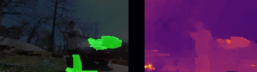
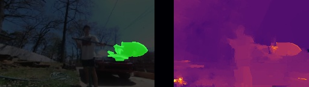
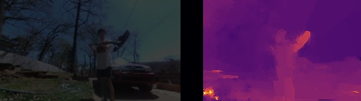
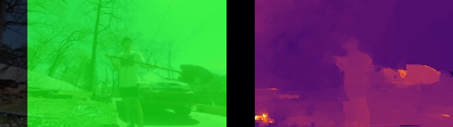
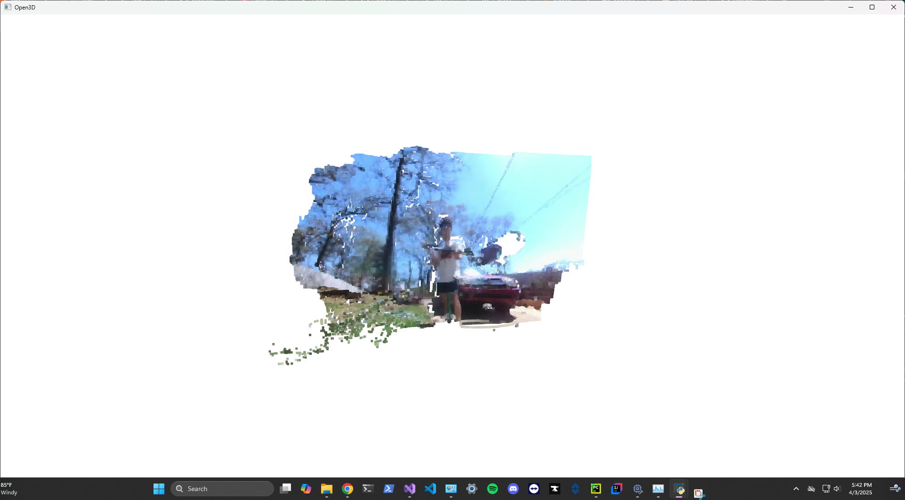
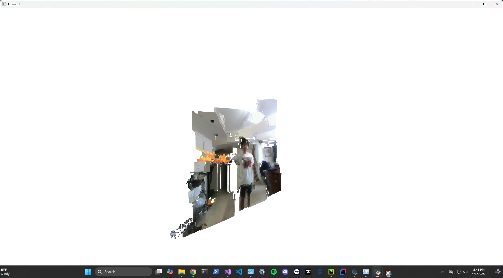
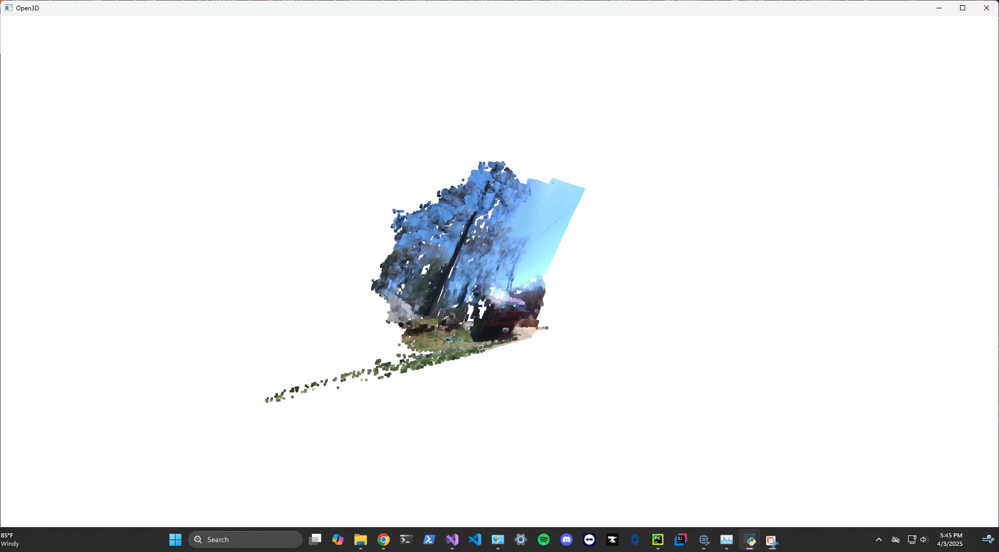

# CS499 Server Branch

## Running the Program

To run the program all you need to do is type the following in the terminal:

>
> python main.py
> 
Make sure that you have installed all the dependencies in `requirements.txt`.

## Configuring the Program

The configuration system is constantly being worked on but here is what is has currently. Here is `config.json` where 
all the configurations are stored.

```json
"emulator_arguments": {
  "enabled": boolean,
  "stream_enabled": boolean,
  "video_name": string,
  "encode_quality": int
}
```
This is for the emulator.`enabled` dictates if the emulator is enabled. 
`stream_enabled` dictates if there will be a camera feed opened for the emulator stream. If `false`, then the video will be used instead.
`video_name` is the name of the video used under `assets/videos`. `encode_quality` determines what quality the frame will be sent from the client, 0-100 where 100 being the best quality.

```json
"server_arguments": {
    "port": 9000,
    "host": "0.0.0.0",
    "socket_type": "TCP",
    "fps": 30
  },
```
Currently, this is only for the StreamCameraServer but we can easily change it for both sockets that will open.

```json
"vision_arguments": {
    "enabled": true,
    "depth_map_capture": true,
    "StereoSGBM_args": {
      "minDisparity": 0,
      "numDisparities": 32,
      "blockSize": 5,
      "uniquenessRatio": 30,
      "speckleWindowSize": 100,
      "speckleRange": 2,
      "disp12MaxDiff": 1
    },
    "scale": 0.5,
    "calibration_file": "calib_50/calibration_50.npz"
  }
```
This is for the computations done on the frames in the frame queue. `StereoSGB_args` determines the parameters for the StereoSGBM_args for the algorithm.
`depth_map_capture` determines if you are able to capture the depth visualization by pressing "c" on the display frame. `scale` determines the scale of the image size and resolution for the algorithm.
And `calibration_file` is the NPZ calibration file used for the setup.

```json
"distance_args": {
      "max_dist": 0.5,
      "min_dist": 0,
      "color": [12,237,16],
      "alpha": 0.75,
      "min_area": 800
    }
```
This is for detection of close objects. The `min_dist` and `max_dist` determine the range where we are looking for. These values are in meters.
`color` is an rgb for the color of the contour outline displayed. `alpha` determines the opacity of the color overlay.
`min_area` this is a threshold value that filters out small artifacts, the bigger the area, the more compact the detections have to be.
So if we were looking for a person we would want to use a large area, but if we wanted to find a coke can maybe a little smaller.
It is recommended to keep this above 700 to avoid getting just noise.

## Examples

### Distance Argument changing
Example with low area:


Example with high area:


Example with really low range:


Example with really high range:


### Point Cloud examples


