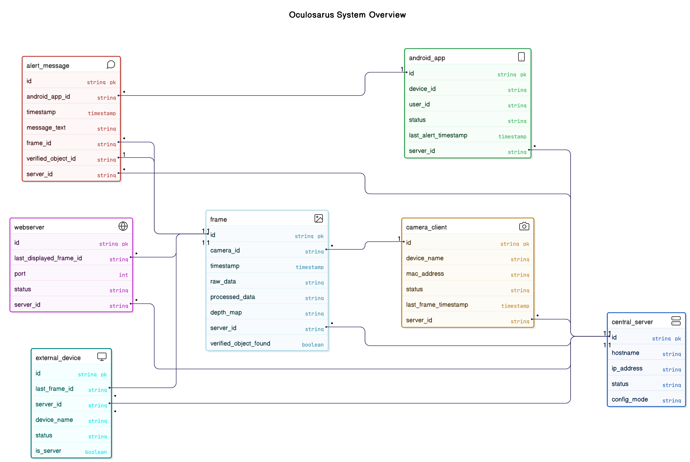
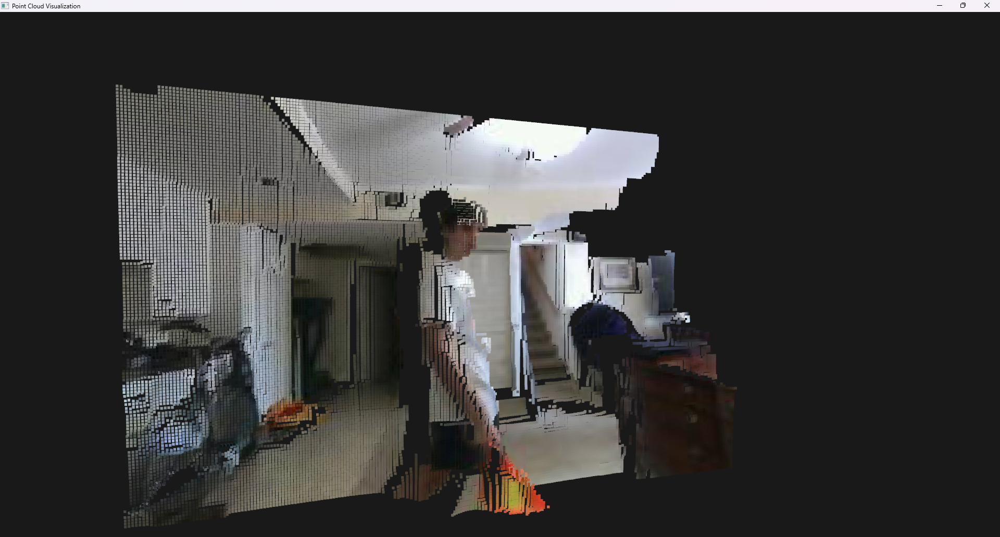

# Oculosarus


## Overview

Oculosarus is an advanced computer vision application designed to enhance navigation capabilities for visually impaired
individuals. The system leverages stereo vision technology to detect nearby objects, providing real-time spatial
awareness through haptic feedback.

## Core Technology

Oculosarus is fundamentally a depth estimation system that uses calibrated stereo cameras to:

- Generate precise disparity maps
- Calculate real-world depth measurements
- Detect and track objects in the user's vicinity
- Transform spatial data into intuitive feedback patterns

The architecture also includes networking and device communication protocols, to have a completely wireless system as a
proof of concept for greater application.

## Hardware Specifications

These are the hardware specifications for our particular build. But it is possible to use a different camera if you
tweak the config and make a new calibration.

- **Camera System**: 7cm baseline stereo camera with 120° field of view
- **Optimal Detection Range**: 0.0m - 0.6m (most accurate detection zone)
- **Maximum Reliable Range**: Approximately 0.8m
- **Processing Unit**: Raspberry Pi 3.5-based embedded system
### Technical Note

Due to the narrow baseline of our stereo camera (7cm), objects beyond our optimal range produce minimal
disparity values that become less reliable with distance. This intentional "nearsightedness" optimizes the
system for close-range obstacle detection, which is important for visually impaired users navigating
unfamiliar environments.

### Architecture

Here is a chart of how the data is flowing between multiple objects in our system:



## Running the Program

To run the program all you need to do is type the following in the terminal:

>
> python main.py
>
Make sure that you have installed all the dependencies in `requirements.txt`.

***Make sure you follow the directions to install PyTurboJPEG here: https://github.com/lilohuang/PyTurboJPEG***

## Configuring the Program

The configuration system is constantly being worked on but here is what is has currently. Here is `config.json` where
all the configurations are stored.

```json
"emulator_arguments": {
"enabled": false,
"stream_enabled": false,
"video_name": "flag1",
"encode_quality": 10
},
```

This is for the emulator.`enabled` dictates if the emulator is enabled.
`stream_enabled` dictates if there will be a camera feed opened for the emulator stream. If `false`, then the video will
be used instead.
`video_name` is the name of the video used under `assets/videos`. `encode_quality` determines what quality the frame
will be sent from the client, 0-100 where 100 being the best quality.

```json
  "pi_arguments": {
    "hostname": "172.24.239.16",
    "port": 22,
    "username": "uab.edu",
    "password": "pi",
    "fps": 30,
    "encode_quality": 50
    },
```

These are for the Raspberry PI, `hostname`, `port`, `username`, and `password` are for SSH connection. `fps` is the
camera locked fps to send and `encode_quality` is the quality the frame will be in.

```json
  "camera_server_arguments": {
    "port": 9000,
    "host": "0.0.0.0",
    "socket_type": "TCP",
    "fps": 30,
    "scale": 0.2
    },
```

This is for the camera processing server. `socket_type` is for the ocekt type the camera client will be sending in, and
what the server will need to use to receive. `fps` is only for artificially altering the fps of the stream, and scale si
for the downsizing.

```json
"vision_arguments": {
    "enabled": true,
    "depth_map_capture": true,
    "calibration_file": "calib_50/calibration_50.npz",
    "StereoSGBM_args": {
    "minDisparity": 0,
    "numDisparities": 32,
    "blockSize": 5,
    "uniquenessRatio": 30,
    "speckleWindowSize": 100,
    "speckleRange": 2,
    "disp12MaxDiff": 1
    },
```

This is for the computations done on the frames in the frame queue. `StereoSGB_args` determines the parameters for the
StereoSGBM_args for the algorithm.
`depth_map_capture` determines if you are able to capture the depth visualization by pressing "c" on the display
frame. `scale` determines the scale of the image size and resolution for the algorithm.
And `calibration_file` is the NPZ calibration file used for the setup.

```json
"distance_args": {
    "max_dist": 0.5,
    "min_dist": 0,
    "color": [12, 237, 16],
    "alpha": 0.75,
    "min_area": 800,
    "object_persistence_threshold": 5,
    "percent_border_scaled_down": 0.2
    },
```

This is for detection of close objects. The `min_dist` and `max_dist` determine the range where we are looking for.
These values are in meters.
`color` is an rgb for the color of the contour outline displayed. `alpha` determines the opacity of the color overlay.
`min_area` this is a threshold value that filters out small artifacts, the bigger the area, the more compact the
detections have to be.
So if we were looking for a person we would want to use a large area, but if we wanted to find a coke can maybe a little
smaller.
It is recommended to keep this above 700 to avoid getting just noise. `object_persistence_threshold` determines what
classifies as a set object, the value is the amount of frames the area needs to be in to be an object.
`percent_border_scaled_down` is for thresholding the border since we have a wide FOV camera, it is how scaled down the
border we run object detection on is.

```json
"3d_render_args": {
    "enabled": true,
    "run_locally": true,
    "refresh_rate": 15
    },
```

This is for the point cloud renderer. `run_locally` runs the visualization locally rather than on another device,
and `refresh_rate` is how often the server will send a frame info packet.

```json
"yolo_arguments": {
    "enabled": false,
    "conf_threshold": 0.8,
    "iou_threshold": 0.45,
    "model_file": "yolo11n.onnx",
    "frame_skip": 5,
    "input_size": [640, 640],
    "class_names": [
      "person", "bicycle", "car", "motorcycle", "airplane", "bus", "train", "truck", "boat", ...
    ]
}
```

This is for the YOLOv11 algorithm to function. `conf_threshold` determines the min confidence in order to classify an
object. `iou_threshold` determines the threshold that two bounding boxes overlap between each other and if they are the
same object.
`frame_skip` is for performance, `input_size` is the frame size the model expects. `class_names` are the IDs of detected
objects, very crucial. Might make it so that we only read a `.yaml` file instead.

## Examples

### Distance Argument changing

Example with low area:


Example with really low range:


Example with really high range:


### Point Cloud examples

When running `visualization_client.py` you are able to get a point cloud visualization.




